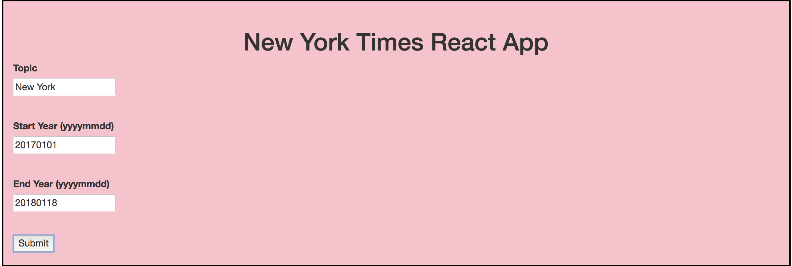
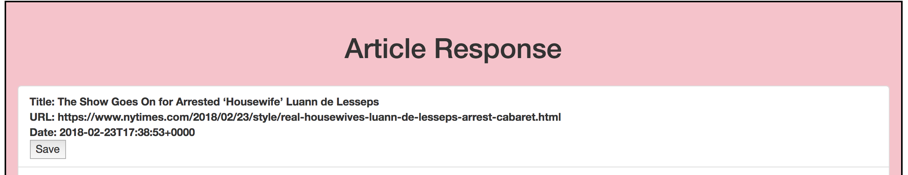
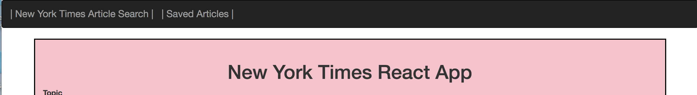
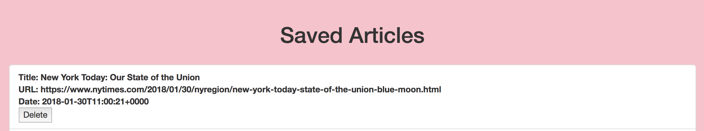

# New York Times React App

**Project Description**

 A full stack MERN Application, in which users can search for any New York Times article by topic and date, save articles they would like to read and delete saved articles that they have already read. This app utilizes, MongoDB, Express.js, React.js, Node.js, CSS3, Bootstrap,  the New York Times API and Heroku.

 
 

**Instructions**

1. *In order to search for articles, users must enter a topic of their choice, a beginning date, and an ending date before hitting the submit button.*

2.  *Once the app returns articles, users will have the option to save articles that they want to read by hitting the **Save** button.

3.  *In order to view saved articles, users must click on the **Saved Articles** tab in the navigation bar.*

4.  *Once on the Saved Articles page, users will be able to delete saved articles that they have already read by hitting the **delete** button. 

    

**Link to Website**
[New York Times React App](https://protected-shelf-79046.herokuapp.com/)